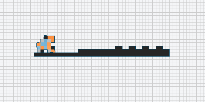

# Yet Another Soft Robot Evolver

This repository uses [Evolution Gym](https://evolutiongym.github.io)
as a base to play with evolutionary computation algorithms and other
weirder things.

It can also be useful as a minimalist codebase to learn how to use
evogym without having to worry about PPO and stuff.

## Files
- `API_test.py`: a playground testing some features of the Evogym API.
- `Search.py`: performs random search or ES based on one robot class
  and one world class.
- `Visualize.py`: shows one robot and one world on the screen (or
  generates a gif)
- `robot/`: a directory containing objects that generate and manipulate
  robots in different ways.
- `robot/simplerobot.py`: generates a robot by random sample, and uses
  a simple sine wave controler on that robot.
- `world/`: a directory containing objects that generate and manipulate
  worlds in different ways.
- `world/walk_line`: generates a world that evaluates one robot on how
  far it can walk. The world is a straight line with random rectangular
  obstacles.
- `TODO.md`: hell.
- `README.md`: guess.

## How to Install:
- Create a local python 3.10 environment using pyenv or similar
- Install evogym: `pip install evogym --upgrade`
- Install linux dependencies (for evogym): `sudo apt install xorg-dev libglu1-mesa-dev`
- Install python dependencies (for evogym): `pip install glfw PyOpenGL ttkbootstrap` 
- Install python dependencies (for this repo): `pip install pygifsicle imageio`

## About
- This repository was created by [Claus Aranha](https://scholar.social/@caranha)
