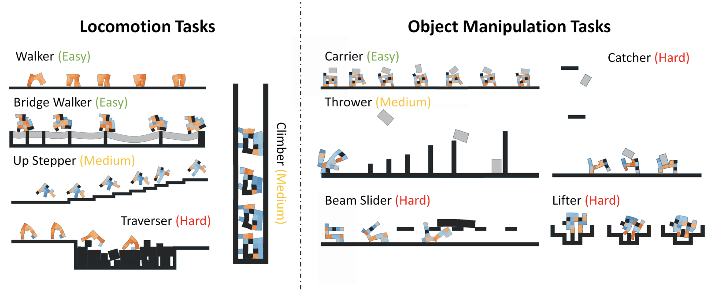
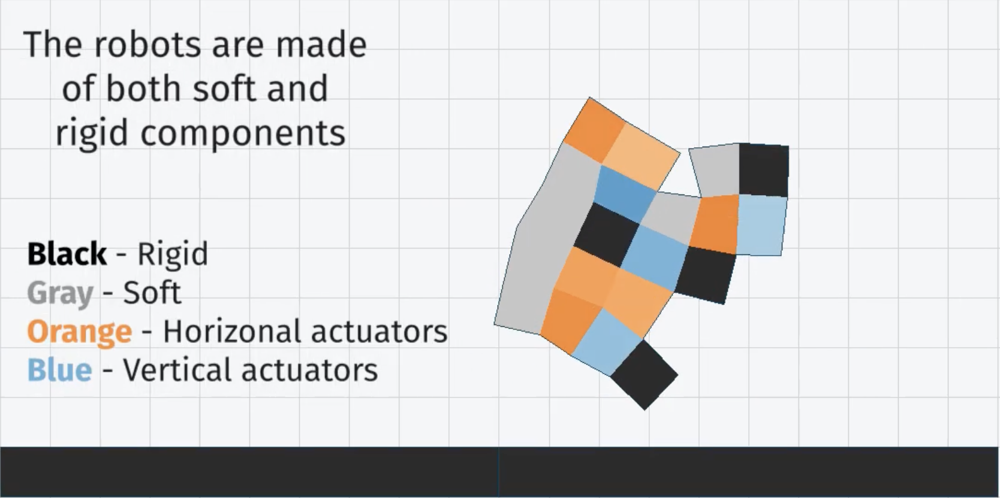
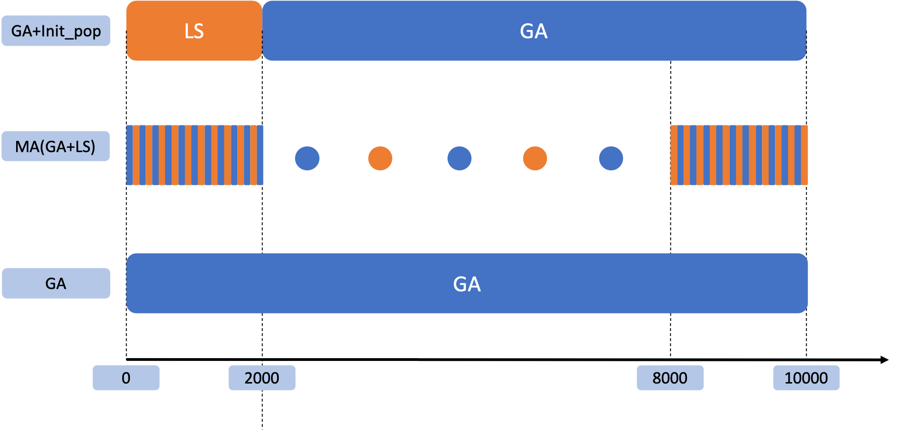
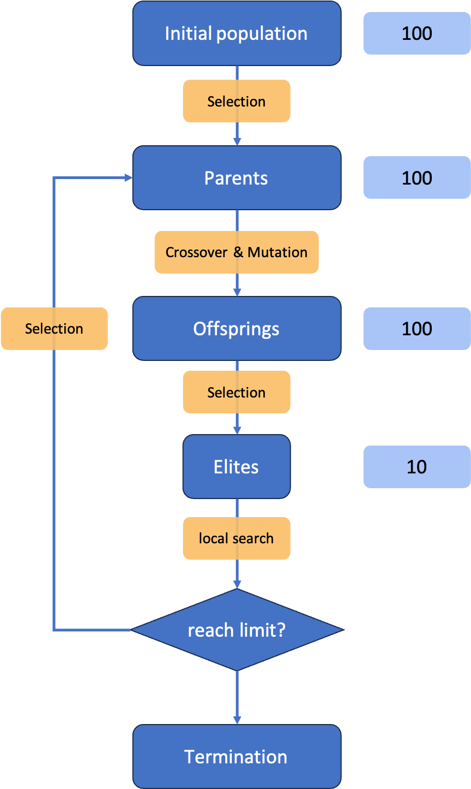
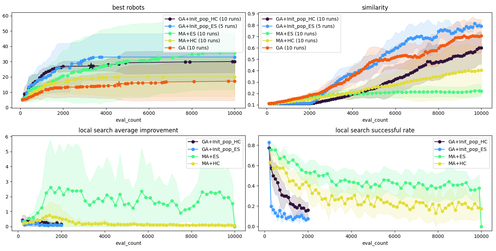
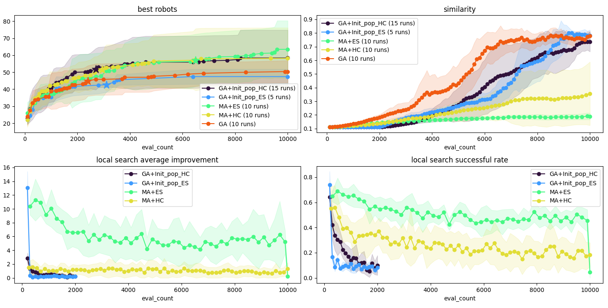
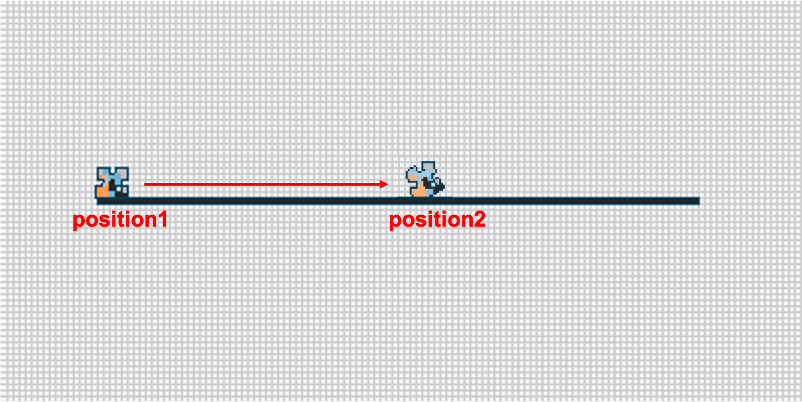
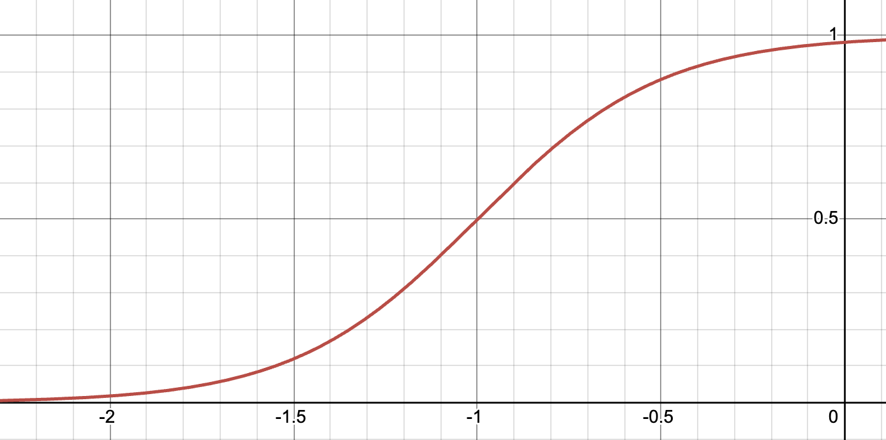
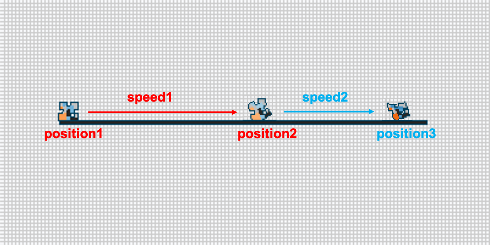
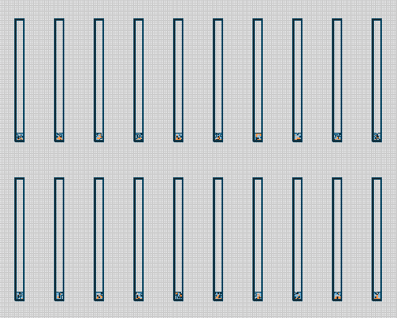

# Evogym

#### LIN CHE CHENG

---
# Topic
## 1. Improve efficiency  on Genetic Algorithm through Local Search

## 2. Stability-Oriented Evaluation

---
<!-- _class: median-text -->
# Evogym
Evogym is a simulation environment that can simulate many different tasks with soft robots. 

A soft robot is composed of 5 different materials. Each kind of materials has its own spring constant.

My research focuses on using evolutionary computing algorithms to modify the body of soft robots in order to find a suitable robot.

---

# Local Search

Local Search is a local optimization algorithm which only imporves the solution by moving to a better neighborhood. Because of its greedy nature, it can quickly find a local optimum. In the other hand, it lacks exploration ability.

I try to combine Local Search and Genetic Algorithm (GA) to develop a hybrid approach that can find a solution more efficiently. 

| Features\Algorithm     | Local Search | Genetic Algorithm (GA) |
| ---------------------- | ------------ | ---------------------- |
| Population Convergence | slow         | quick                  |
| Exploration            | poor         | good                   |
| Evolution              | individual   | population             |

---

# Algorithms

To integrate Local Search with GA, I explored two approaches. The first approach applies Local Search before the GA. The second approach interleaves Local Search with the GA.

---
<!-- _class: median-text -->
# Memetic Algorithm (MA)
In the MA, Local Search performed behind the GA in each round.
For reducing the computational cost, Local Search is applied to only a certain proportion of the population.

---
<!-- _class: small-text -->
# Experiment Results

My analysis focuses on three aspects: fitness, similarity, and the effects by Local Search.

I also compared two Local Search algorithms, Hill Climbing and Evolutionary Strategy, to investigate their impact on the overall performance.

Applying Local Search before GA can enables the algorithm to identify better individuals in the early stages.

The MA achieves lowest similarity while maintaining a high fitness in final.

For effects of Local Search, Evolutionary Strategy (ES) performs better than Hill Climbing (HC).

**Task**:
1. Climber-v0T
2. ObstacleTraverser-v0T

---

# Stability-Oriented Evaluation

The method of fitness evaluation in Evogym usually use the distance to start point as score.
**formula**: 
$$
fitness = position2 - position1
$$

---
<!-- _class: small-text -->
# Stability-Oriented Evaluation

However, robots fail to learn the locomotion strategy required for the task in some cases. Therefore, I designed a new evaluation method to encourage the robots to learn the correct locomotion behavior.

There is a bonus simulation $\Delta t$ continues the original simulation. We calculate the speeds for each of the two stages seperately and its $ratio = (speed2 - speed1) / |speed1|$. The final score will be the original score multiplied by $sigmoid(ratio)$.

**formula**: 
$$
\begin{align}
& sigmoid(x) = \frac{1}{(1+e^{-4(x+1)})} \\
& fitness_{mod} = fitness \times sigmoid(ratio) \\
\end{align}
$$

---
<!-- _class: small-text -->
# Experiment Results

**Task**: Climber-v0T
Upper part: my evaluation
Lower part: old evaluation

The successful rate from 40% up to 90%.

---

# Future Works

1. Compared with conventional Local Search, ES is more effective at finding high-quality solutions. In future work, I plan to integrate more ES-related techniques into my framework.
2. Currently, the Stability-Oriented Evaluation is limited to tasks involving repetitive motions and may lead to reduced speed. Future work will focus on generalizing the approach to a broader range of tasks.